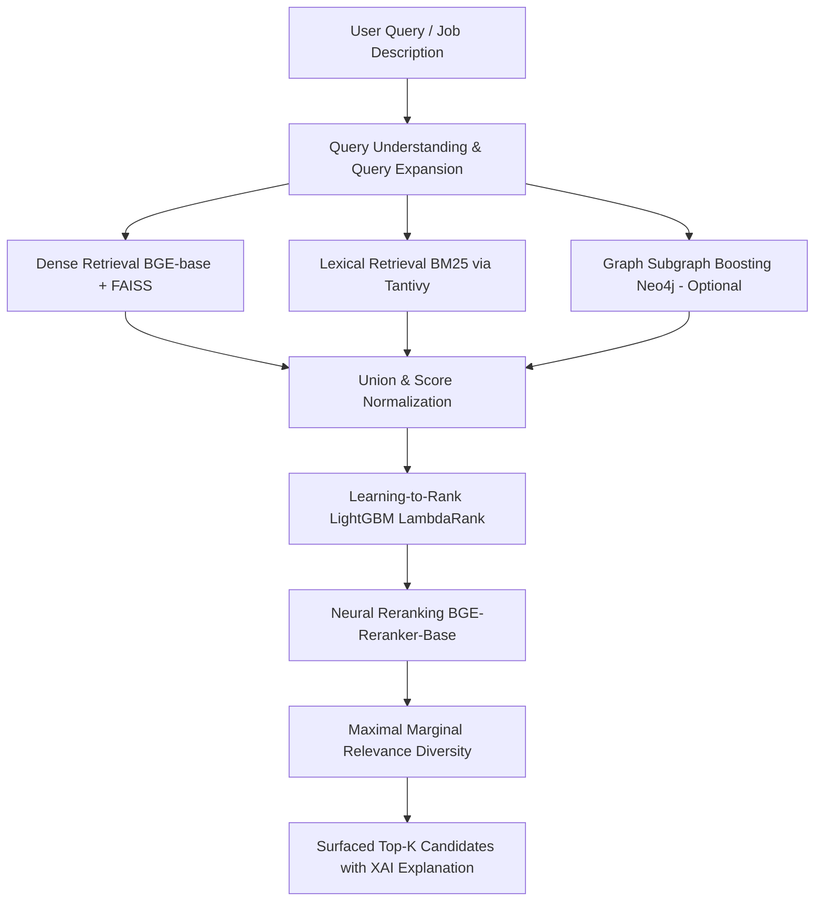

# 🌟 Enterprise-Grade Hybrid Candidate Retrieval System

Welcome to the **Hybrid Candidate Retrieval System**, a state-of-the-art talent-search platform combining semantic understanding, precise keyword matching, deep neural reranking, graph-based boosting, and machine-learned ranking (LTR).

This platform leverages modern information retrieval (IR) and NLP techniques to surface the most relevant candidates for any given search query or job description.

---

## 🏗️ System Architecture

Our multi-stage search and ranking pipeline operates as follows:



1. **Multi-Stage Recall**:
   - **Dense/Vector Search**: Uses `BAAI/bge-base-en-v1.5` embeddings in a FAISS index to understand semantic concepts (e.g., matching "data wrangler" with "Data Engineer").
   - **Lexical/BM25 Search**: Uses a high-performance Rust-backed `Tantivy` engine for strict keyword and acronym matching (e.g., "AWS", "CI/CD").
   - **Graph Database Boosting (Optional)**: Connects to a `Neo4j` database to boost candidate scores based on shared skill subgraphs.
2. **Learning-to-Rank (LTR) Reranking**: Blends dense, lexical, and metadata scores (e.g., years of experience, skill overlap, profile quality) using a trained `LightGBM` LambdaRank booster (`lambdarank_model.txt`).
3. **Cross-Encoder Neural Reranking**: Utilizes `BAAI/bge-reranker-base` to capture deep query-candidate semantics.
4. **Maximal Marginal Relevance (MMR)**: Ensures diversity among top retrieved profiles to avoid presenting redundant candidate profiles.
5. **Explainable AI (XAI)**: Displays real-time scoring breakdowns (BM25, Dense, Reranker, and LTR weightings) alongside interactive verbal summaries explaining exactly *why* a candidate fits.

---

## ⚡ Quick Start: Instant Testing

The system supports a **Zero-Setup Pure Browser Mock Mode** where search is performed directly inside the frontend using heuristics-based semantic similarity and custom client-side BM25. This lets you test the UI immediately without booting any backend.

### 🚀 Starting the FastAPI Backend

1. **Navigate to the Backend directory**:
   ```bash
   cd backend
   ```
2. **Activate the Virtual Environment**:
   ```bash
   source venv/bin/activate
   ```
3. **Start the FastAPI Server**:
   ```bash
   python main.py
   ```
   *Note: On the first boot, BGE models will be loaded and candidate embeddings will be pre-computed and cached to `profiles.npy` and `faiss_index.bin` for instant subsequent server boots (< 1s).*

### 🖥️ Starting the React Frontend

1. **Navigate to the Frontend directory**:
   ```bash
   cd my-hybrid-app
   ```
2. **Install Dependencies (if not already installed)**:
   ```bash
   npm install
   ```
3. **Run the React Dev Server**:
   ```bash
   npm start
   ```
   *The application will launch automatically in your browser at `http://localhost:3000`.*

---

## 🏋️ Training & Fine-Tuning Pipelines

If you want to train or refine the ranking models offline, use the modular scripts inside the `training/` directory.

### 1. Learning-To-Rank (LTR) Training
To train the LightGBM LambdaRank model using synthetic click logs:
```bash
# Ensure you are in the project root with the virtualenv active
cd training

# 1. Generate click simulator logs
../backend/venv/bin/python generate_clicks.py

# 2. Build training dataset from click logs
../backend/venv/bin/python generate_training_data.py

# 3. Train LightGBM ranker (outputs lambdarank_model.txt to backend/)
../backend/venv/bin/python train_ltr.py
```

### 2. Fine-Tuning the BGE Retriever
To fine-tune the dense retriever on custom recruiter search query triplets (hard negatives extraction + MultipleNegativesRankingLoss):
```bash
../backend/venv/bin/python train_retriever.py
```

---

## 📡 API Reference

### POST `/search`
Retrieves candidates matching a search query.

**Request Body**:
```json
{
  "query": "Senior Python developer with AWS",
  "top_k": 10,
  "weights": {
    "dense": 0.5,
    "bm25": 0.5
  },
  "enable_ltr": true,
  "enable_reranker": true,
  "enable_mmr": true,
  "diversity_factor": 0.7
}
```

**Response Snapshot**:
```json
{
  "results": [
    {
      "id": 482,
      "name": "Jane Doe",
      "score": 0.892,
      "core_skills": "Python, AWS, Django",
      "secondary_skills": "PostgreSQL, Docker",
      "years_of_experience": 8,
      "potential_roles": "Senior Software Engineer",
      "explanation": {
        "dense_score": 0.812,
        "bm25_score": 14.28,
        "ltr_score": 0.854,
        "rerank_score": 0.892,
        "summary": "Jane is an exceptional fit for this role with 8 years of experience, direct matches on core skills (Python, AWS), and highly correlated semantic capabilities."
      }
    }
  ]
}
```

---

## 🌟 Premium UX & Visual Features
* **Visual Match Explainability Radar**: An interactive radar/bar visualization explaining the composition of the candidate's scores.
* **Weights Slider**: Real-time slider adjusting BM25 vs. Dense similarity relevance directly on the fly.
* **Toggle Options**: Instant checkboxes to enable/disable LTR, Cross-Encoder Reranking, and MMR Diversity.
* **Glassmorphic Dark Theme**: Premium aesthetic designed to match state-of-the-art enterprise search tools.
